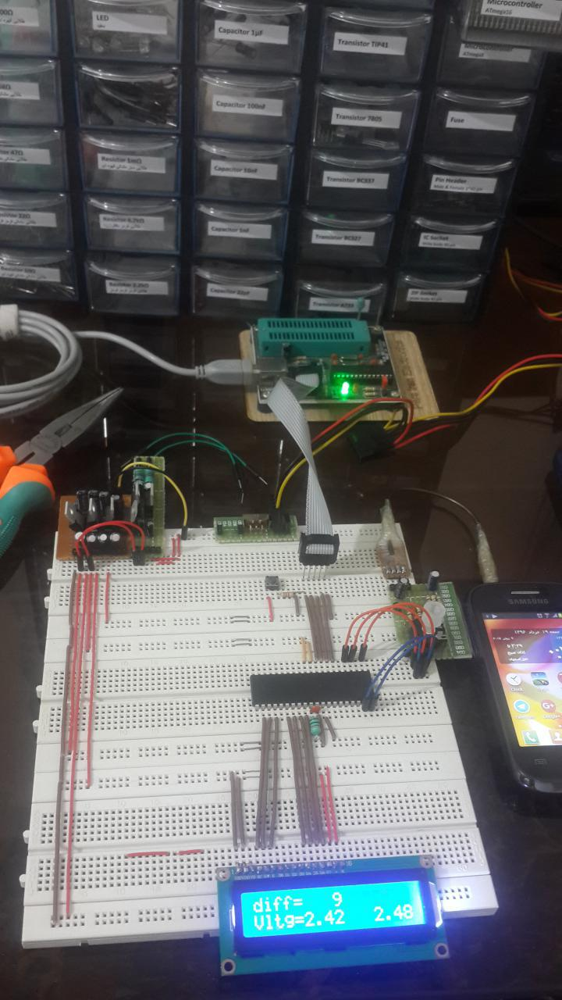

Audio Jack AVR Modem
====

AudioJackAVRModem is a wired, low-cost and platform independent solution for communication between an Arduino and mobile phones. It uses the phone's audio jack and Bell 202 modem-like FSK encoding.
